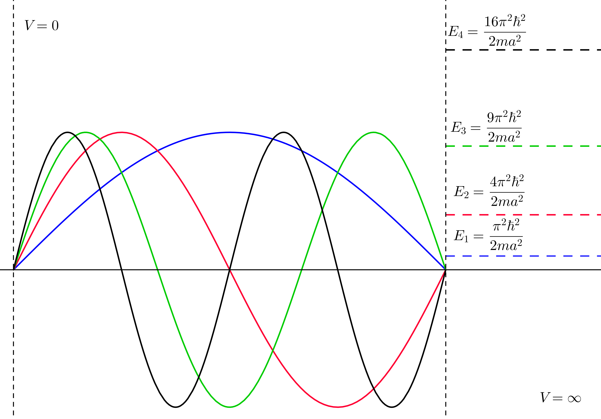
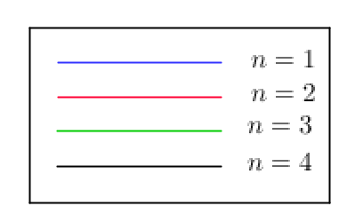
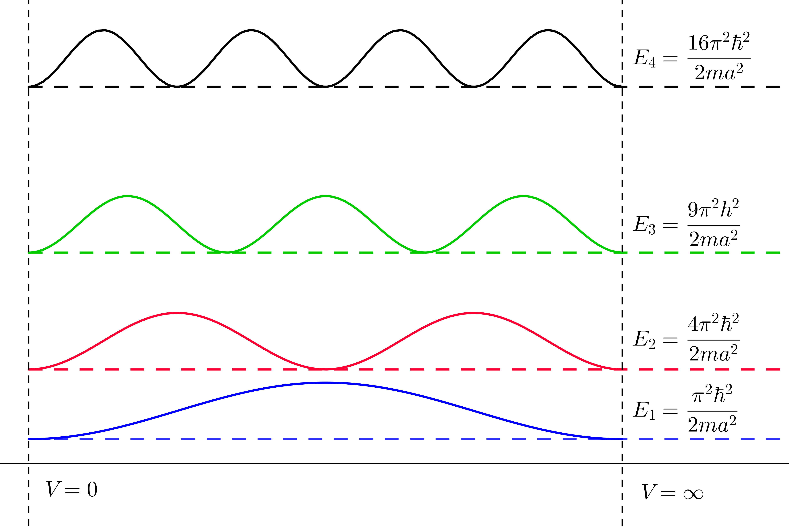

## Particle in a Box

Central to Schrödinger's formulation 
is the requirement of boundary conditions. A quantum mechanical problem with no boundary conditions is ill defined\footnote{see the Ultraviolet Catastrophe}. Furthermore, the quantization of the system falls out of the required bound conditions.

The simplest characterization of a quantum system is the so called "Particle in a Box" problem in one dimension. Here, the potential energy within a confined range (say from 0 to $a$) is set to zero and the potential energy outside of the range, infinite. The Hamiltonian then becomes

 $$
   H = T + V =  \left\{
     \begin{array}{lr}
       -\frac{\hbar^2}{2m}\nabla^2 & : x \in (0,a)\\
       \infty & : x \notin (0,a)
     \end{array}
   \right.
$$ {#eq:hamiltonian_particle_in_a_box}

Note that this characterization provides the boundary conditions required for quantization, 
namely that $\psi(0)=\psi(a)=0$. Intuitively, we can easily reason that if the potential 
energy at 0 and at $a$ is infinite, then the probability that a particle will be at 0 
or at $a$ is nil. We can use these bounds to solve the time-independent 
Schrödinger equation in one-dimension.

$$-\frac{\hbar^2}{2m}\nabla^2 \psi(x) = E\psi(x)$$ {#eq:particle_in_a_box_eigenequation}

$$- \psi''(x) = \frac{2Em}{\hbar^2}\psi(x)$$ {#eq:particle_in_a_box_intermediate}

$$-\psi''(x)= \lambda^2\psi(x)\ \text{ where } 
\lambda=\frac{\sqrt{2mE}}{\hbar}$$ {#eq:solution_particle_in_a_box}

This equation has solutions of the form $\psi(x)=A\sin(\lambda x)$ where 
$\lambda =\frac{n\pi}{a}$, $n\in\mathbb{N}$. Recalling that we require normality 
in our wavefunctions, we can find $A$. 

$$\left\langle A\sin\left(\frac{n\pi}{a} x\right) 
\bigg\rvert A\sin\left(\frac{n\pi}{a} x\right)\right\rangle = 1
\implies A =\sqrt{\frac{2}{a}}
$$ {#eq:adjointness_finds_lambda}

Then, we have the eigenfunctions, 
$\psi(x)=\sqrt{\frac{2}{a}}\sin\left(\frac{n\pi}{a} x\right)$ with corresponding 
eigenvalue energy levels $E=\frac{n^2\pi^2\hbar^2}{2ma^2}$. Note that the energy can only 
take values defined by the eigenproblem, $E_1=\frac{\pi^2\hbar^2}{2ma^2}$, 
$E_2=\frac{4\pi^2\hbar^2}{2ma^2}$, ... In other words, the energy is discrete and not 
continuous. It is quantized. Furthermore, it is of note that there is no "zero". The lowest
possible value for the energy, the "ground" state, is $E_1=\frac{\pi^2\hbar^2}{2ma^2}$.

\vfill

<!-- \begin{figure}[h]
\minipage{0.32\textwidth}
\includegraphics[width=\textwidth]{assets/graphics/1dbox-geo.png}
\caption{Wave Functions \& Energies in a 1-D Box}
\endminipage\hfill
\minipage{0.32\textwidth}
\centering
\includegraphics[width=1in]{assets/graphics/n.png}
\endminipage\hfill
\minipage{0.32\textwidth}
\includegraphics[width=\textwidth]{assets/graphics/1dbox-prob.png}
\caption{Probability Distributions in a 1-D Box}
\endminipage\hfill
\end{figure} 
-->

The wave function should not be interpreted as some sort of function of space and time. 
This is a solution to the time-independent Schrödinger equation and describes a *steady-state*. 
Recall that the solutions should be used to generate probability distributions. 
Then when the energy corresponds to $E_i$, $p:=\rvert\psi_i\rvert^2$ describes the probability 
that the particle will be found at a given location. 

