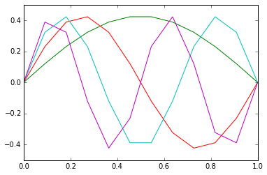
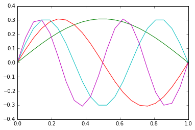
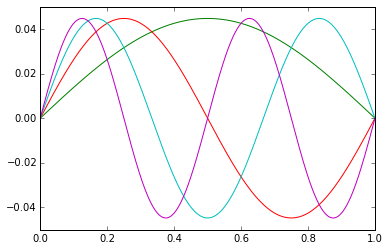

## Computational Science

Strang's *Computational Science and Engineering* [@strang2007computational] devotes the bulk of its first chapter to a discussion of this very matrix

$$D =
\frac{1}{h^2}\left(\begin{matrix}
 2 & -1 &  0 & \dots &  0 &  0 &  0 \\
-1 &  2 & -1 & \dots &  0 &  0 &  0 \\
 0 & -1 &  2 & \dots &  0 &  0 &  0 \\
\vdots & \ & \ & \ddots & \ & \ & \vdots \\
 0 &  0 &  0 & \dots &  2 & -1 &  0 \\
 0 &  0 &  0 & \dots & -1 &  2 & -1 \\
 0 &  0 &  0 & \dots &  0 & -1 &  2 \\
\end{matrix}\right)\approx\frac{d^2}{dx^2}
$$

This matrix has several significant properties:

1. It is symmetric.
2. It is sparse.
3. It is tridiagonal.
4. The matrix has constant diagonals.
5. It is invertible.
6. It is positive definite\footnote{This means that the matrix will have $n$ positive (and therefore real) eigenvalues. From this we know that the matrix $D$ is self-adjoint.}.


### Numpy and Scipy as Wrapper to BLAS and Lapack
If performance is a priority than computational mathematics must be done using C and its libraries [BLAS](http://www.netlib.org/blas/), [Lapack](http://www.netlib.org/lapack/), and [Arpack](http://www.caam.rice.edu/software/ARPACK/). Prior to understanding the underlying mathematics, we posit that rapid prototyping and an interactive development environment should be prioritized over performance. Toward this end, we offer as an alternative to C and its computational libraries, Python and its computational libraries [Numpy](http://www.numpy.org/) and [Scipy](http://www.scipy.org/). Numpy and Scipy are open-source (free in all senses). Numpy and Scipy offer a robust interactive development environment in [IPython](http://ipython.org/). Furthermore, we believe that Python syntax is descended from C syntax and note that Numpy and Scipy are high-level wrappers to the same Fortran functions being used in BLAS and Lapack, and therefore porting a robust and vetted algorithm from Python to C should be straight-forward where non-trivial.

Later in this document we explore the [Gnu Scientific Library](https://www.gnu.org/software/gsl/).

Worth further invesigation are going directly to netlib which is largely maintained in Fortran. Netlib maintains [BLAS](http://www.netlib.org/blas/), [LAPACK](http://www.netlib.org/lapack/), [PLASMA](http://icl.cs.utk.edu/plasma/), and [MAGMA](http://icl.cs.utk.edu/magma/).

\vfill

\pagebreak


### Implementing a Second Difference Matrix in numpy

We have written the following function based upon *CSE* [@strang2007computational]. It creates four matrices, each corresponding to a different set of boundary conditions: `D`, for Dirichlet\footnote{Also known as \emph{fixed-fixed conditions} and defined by zeroes at the boundaries of the function.}, `R` for Robin\footnote{Also known as \emph{free-fixed conditions} and defined by zero in the first derivative of the function at one end of the function and zero in the value of the function at the other.}, `N` for Neuman\footnote{Also known as \emph{free-free conditions} and defined by zeroes in the first derivative of the function at the boundaries of the function.}, or `C` for circular\footnote{Defined by equality in the value of the function and in the value of its first derivative at the boundaries}.

```python
def secondDiff(type,n=10,sparse=False):
    '''
    secondDiff Create finite difference model matrix.
    TYPE is one of the characters 'D', 'R', 'N', or 'C'.
    3rd argument is boolean for sparseness
    '''
    import numpy, scipy.sparse
    e = numpy.ones(n)
    e_off = numpy.ones(n-1)
    D = scipy.sparse.csr_matrix(
      scipy.sparse.diags([e_off,-2*e,e_off],[-1,0,1]))

    if (str(type) == 'R' or str(type) == 'T' or
        str(type) == 'N' or str(type) == 'B'):
        D[0,0] = -1
    if (str(type) == 'N' or str(type) == 'B'):
        D[n-1,n-1] = -1
    if str(type) == 'C':
        D[0,n-1] = 1
        D[n-1,0] = 1

    if sparse == False: return D.todense()
    else: return D
```

\vfill

\pagebreak


\vfill

\pagebreak


### Discrete Representation of the Particle in a Box

To conclude this introduction, we note that we can discretely represent the
Hamiltonian operator ([@eq:hamiltonian_particle_in_a_box]) describing the
"particle in a box" using the matrix `D` defined by this function.

We use the IPython interactive terminal to execute the commands and find its `%paste`
magic function very useful.

We first load the function `secondDiff`.

We then load the following python modules:

```python
In [2]: import numpy, numpy.linalg, scipy.linalg, matplotlib.pyplot

## -- End pasted test --
```

We define the matrix equation describing the particle in a box as  

$$-D\mathbf{u}=\frac{2mE}{\hbar^2} \mathbf{u}$$ {#eq:matrix_eqn_particle_in_a_box}

For $D$, which describes Dirichlet boundary conditions, we have

* $\theta_k = k\pi/(n+1)$
* eigenvalues, $E_k = 2-2\cos\theta_k$
* eigenfunctions, $u_k = (\sin k\pi h, \sin 2k\pi h, \dots, \sin n\pi h)$

for $k\in[1,n]$.

We define each of these in our IPython session.

\vfill

\pagebreak

```python
In [3]: %paste
def K_theta(k,n):
  return k*numpy.pi/(n+1)

def K_eigenvalues(n):
  return 2*numpy.ones(n) - 2*numpy.cos(K_theta(numpy.linspace(n,1,n),n))

def K_eigenfunction(k,n):
  vec = numpy.sin(K_theta(numpy.linspace(1,n,n),n)*k)
  return vec/numpy.linalg.norm(vec)

## -- End pasted text --
```

We next create our second difference matrices for Dirichlet boundary conditions with
$n=2,3,4,5$. We display `K4` for visual inspection.

```python
In [4]: %paste
K2 = -secondDiff('D',2)
K3 = -secondDiff('D',3)
K4 = -secondDiff('D',4)
K5 = -secondDiff('D',5)
print K4

## -- End pasted text --
[[ 2. -1. -0. -0.]
 [-1.  2. -1. -0.]
 [-0. -1.  2. -1.]
 [-0. -0. -1.  2.]]
```

\vfill

\pagebreak


### Finding Eigenvalues

We then use the built-in eigensolver in `numpy.linalg` to find the eigenvalues and compare
it to the values generated by our function. Note that the first element in the array
returned by `numpy.linalg.eig` is an array of the eigenvalues.

```python
In [5]: %paste
e2 = numpy.linalg.eig(K2)
e3 = numpy.linalg.eig(K3)
e4 = numpy.linalg.eig(K4)
e5 = numpy.linalg.eig(K5)
print e2[0]
print K_eigenvalues(2)
print e3[0]
print K_eigenvalues(3)
print e4[0]
print K_eigenvalues(4)
print e5[0]
print K_eigenvalues(5)

## -- End pasted text --
[ 3.  1.]
[ 3.  1.]
[ 3.41421356  2.          0.58578644]
[ 3.41421356  2.          0.58578644]
[ 3.61803399  2.61803399  0.38196601  1.38196601]
[ 3.61803399  2.61803399  1.38196601  0.38196601]
[ 3.73205081  3.          2.          0.26794919  1.        ]
[ 3.73205081  3.          2.          1.          0.26794919]
```

\vfill

\pagebreak


### Finding Eigenvectors

The second element in the array by `numpy.linalg.eig` is a matrix of the eigenfunctions.
Please understand that we are liberal with our implicit understanding that eigenfunctions
and eigenvectors are, for our purposes, synonymous.


```python
In [6]: %paste
print e2[1]
print K_eigenfunction(1,2)
print K_eigenfunction(2,2)

## -- End pasted text --
[[ 0.70710678  0.70710678]
 [-0.70710678  0.70710678]]
[ 0.70710678  0.70710678]
[ 0.70710678 -0.70710678]

In [7]: %paste
print e4[1]
print K_eigenfunction(1,4)
print K_eigenfunction(2,4)
print K_eigenfunction(3,4)
print K_eigenfunction(4,4)

## -- End pasted text --
[[-0.37174803 -0.60150096 -0.37174803 -0.60150096]
 [ 0.60150096  0.37174803 -0.60150096 -0.37174803]
 [-0.60150096  0.37174803 -0.60150096  0.37174803]
 [ 0.37174803 -0.60150096 -0.37174803  0.60150096]]
[ 0.37174803  0.60150096  0.60150096  0.37174803]
[ 0.60150096  0.37174803 -0.37174803 -0.60150096]
[ 0.60150096 -0.37174803 -0.37174803  0.60150096]
[ 0.37174803 -0.60150096  0.60150096 -0.37174803]
```


### Comparison of timing

For comparison of timing, we introduce a function that will return the exact same
values as the built-in eigensolver.

```python
In [8]: %paste
def my_eig(n):
    vals = []
    vals.append(K_eigenvalues(n))
    eigenvectors = numpy.matrix(K_eigenfunction(1,n))
    for i in range(n-1):
        eigenvectors = numpy.r_[eigenvectors,
                                numpy.matrix(K_eigenfunction(i+2,n))]
    vals.append(eigenvectors)
    return vals

## -- End pasted text --
```

We visually inspect the three by three output.


```python
In [9]: %paste
print my_eig(3)
print numpy.linalg.eig(K3)

## -- End pasted text --
[array([ 3.41421356,  2.        ,  0.58578644]),
matrix([[  5.00000000e-01,   7.07106781e-01,   5.00000000e-01],
        [  7.07106781e-01,   8.65956056e-17,  -7.07106781e-01],
        [  5.00000000e-01,  -7.07106781e-01,   5.00000000e-01]])]
(array([ 3.41421356,  2.        ,  0.58578644]),
matrix([[ -5.00000000e-01,  -7.07106781e-01,   5.00000000e-01],
        [  7.07106781e-01,   4.05925293e-16,   7.07106781e-01],
        [ -5.00000000e-01,   7.07106781e-01,   5.00000000e-01]]))
```
\vfill

\pagebreak

We use the IPython magic function `%timeit` to run our timing comparisons.
```python
In [10]: %paste
%timeit numpy.linalg.eig(K5)
%timeit my_eig(5)

## -- End pasted text --
The slowest run took 6.73 times longer than the fastest.
This could mean that an intermediate result is being cached
10000 loops, best of 3: 31.8 µs per loop
1000 loops, best of 3: 188 µs per loop
```

We note that the built-in eigensolver is nearly six times faster than our algorithm.

```python
In [11]: %paste
K10 = secondDiff('D',10)
%timeit numpy.linalg.eig(K10)
%timeit my_eig(10)

## -- End pasted text --
10000 loops, best of 3: 49.8 µs per loop
1000 loops, best of 3: 427 µs per loop
```

We note that the built-in eigensolver is nearly ten times faster than our algorithm.

```python
In [12]: %paste
K100 = secondDiff('D',100)
%timeit numpy.linalg.eig(K100)
%timeit my_eig(100)

## -- End pasted text --
100 loops, best of 3: 9.06 ms per loop
100 loops, best of 3: 4.97 ms per loop
```

This last result is astounding. Suddenly our algorithm is almost twice as fast as
the built-in solver.


\vfill

\pagebreak


### Exploring This Result

We wish to collect data over times to find eigenvalues and eigenvectors for increasing
values of $n$. Note that our method does not actually use the matrix, but rather uses
analytical results based on our knowledge of the second difference matrix for Dirichlet
boundary conditions. We will need, however, to pass a matrix to the built-in eigensolver.
We wish to create this matrix outside of the timer so as not to penalize the eigensolver.

We wrote the following simple IPython script:

```time_test.ipy
for i in range(3,300):
	matrix = secondDiff('D',n)
	result_my  = %timeit -o my_eig(n)
	result_sys = %timeit -o numpy.linalg.eig(matrix)
	%store result_my.best, result_sys.best >> output.txt


import numpy, numpy.linalg, matplotlib.pyplot
data = numpy.genfromtxt('output_1442991327.csv', delimiter=',')
indep = data[:,0]
my_eig_data = data[:,1]
sys_eig_data = data[:,2]
my_eigensolver = matplotlib.pyplot.plot(indep,my_eig_data)
system_eigensolver = matplotlib.pyplot.plot(indep,sys_eig_data)
matplotlib.pyplot.legend(["My Eigensolver", "Numpy's Eigensolver"])
matplotlib.pyplot.show()
```

\begin{figure}
\centering
\includegraphics[width=\textwidth]{assets/graphics/figure_1.png}
\caption{Scaling to $n=300$}
\end{figure}

\vfill

\pagebreak


### Plotting the first few eigenfunctions

```python
def for_plot_K_eigenfunction(k,n):
  vec = K_eigenfunction(k,n)
  soln = np.insert(vec,0,0)
  soln = np.insert(np.zeros(1),0,soln)
  return soln   

def plot_m_K_eigenfunctions(m,n):
  for i in range(m+1):
  plt.plot(np.linspace(0,1,n+2),for_plot_K_eigenfunction(i,n))  

plot_m_K_eigenfunctions(4,10)
plot_m_K_eigenfunctions(4,20)
plot_m_K_eigenfunctions(4,1000)
```









<!--
\begin{figure}[h]
\minipage{0.32\textwidth}
\includegraphics[width=\textwidth]{assets/graphics/1_5_eigenvectors_23_1.png}
\caption{First four eigenfunctions, n=10}
\endminipage\hfill
\minipage{0.32\textwidth}
\centering
\includegraphics[width=\textwidth]{assets/graphics/1_5_eigenvectors_24_1.png}
\caption{First four eigenfunctions, n=20}
\endminipage\hfill
\minipage{0.32\textwidth}
\includegraphics[width=\textwidth]{assets/graphics/1_5_eigenvectors_25_1.png}
\caption{First four eigenfunctions, n=10000}
\endminipage\hfill
\end{figure}
-->

