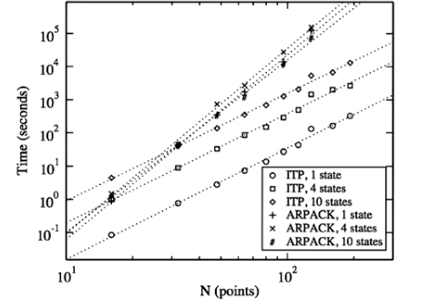
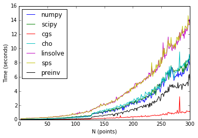
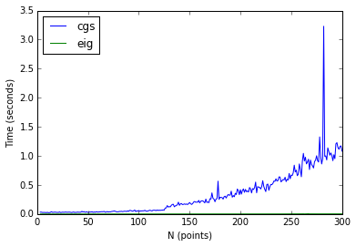

# the Imaginary Time Propagation Method

## Applications of Imaginary Time Propagation Method in Material Research


We are seeking approximate solutions to the time-independent Schr&ouml;dinger equation

\begin{align*}
H\Psi_i&=E_i\Psi_i\tag{eqn. 1}\\
\text{with }\hat{H}=\hat T + \hat V &= -\frac{\hbar^2}{2m}\Delta + V
\end{align*}

If we can find the eigenfunctions that satisfy these equations, the corresponding eigenvalues can be found by calculating the expectation value

$$\langle \psi_i \rvert H \rvert \psi_i \rangle$$

Our approach is the solve the time-dependent Schr&ouml;dinger equation 

$$i\hbar\frac{\partial}{\partial t}\Psi = \hat H \Psi$$

by converting it via a Wick rotation (let $t=-i\tau$) to a simple heat equation:

\begin{align*}
\frac{\partial}{\partial t}\Psi=-\frac{\hat H}{\hbar}\Psi\tag{eqn. 2}
\end{align*}

Our solutions are then given by 

\begin{align*}\Psi(r,t)=e^{-\hat H\tau/\hbar}\psi(r,0)=\left(e^{-\hat H\Delta\tau/\hbar}\right)^n\psi(r,0)\tag{eqn. 3}\end{align*}

Then $\left(e^{-\hat H\Delta\tau/\hbar}\right)^n$ has the same eigenfunctions as $H\Psi_i=E_i\Psi_i$. If we iterate the decay equation it will converge on the ground state. 

We can solve eqn. 3 by treating it as an analog of the power method or its generalization the subspace iteration. 

As presented at NSF PREM Colloquium.

Helium droplets not only provide a unique matrix environment for high resolution spec- troscopy and studying molecular solvation but also allow to use guest molecules as probes of the surrounding quantum medium.1–3 After the initial discovery of the helium droplet tech- nique for spectroscopic applications, attention quickly turned into characterizing the physical properties of the helium droplets themselves. The groundbreaking experiments by the Toen-nies group employed the glyoxal molecule as a probe to study the helium droplet response through optical absorption spectrum.

## the Imaginary Time Propagation

The imaginary time propagation method (ITP) relies on solving the
time-dependent Schrödinger equation in imaginary time. We perform a Wick Rotation (setting $t=-i\tau$) to transform the time-dependent Schrödinger into a simple diffusion equation

\begin{equation}
\label{eq:itpSch}
\frac{\partial \psi(r,\tau)}{\partial
\tau}=-\frac{\hat{H}}{\hbar}\psi(r,\tau) \implies \psi(r,\tau)=\exp(-\hat{H}\tau/\hbar)\psi(r,0)
\end{equation}

\paragraph{Iterative Solutions to Eigenproblems}This can be thought of as the analog to a power solution or subspace iteration. As $\tau\to\infty$, $\psi(r,\tau)$ will converge on the eigenfunction for the ground state.

In practice, a random vector is chosen as the initial state. A time-propagation will yield the ground state eigenvector. If a vector other than the ground state is desired, $N$ separate wave functions are propagated. Each higher state eigenvector is required to be orthogonal to the lower eigenvectors and are thus discovered through the iterative process. Approximate orthogonality is enforced in the following way.

\begin{equation}
\label{eq:appxOrth}
\frac{\partial\psi_i(r,\tau)}{\partial\tau} = -\frac{\hat{H}}{\hbar}\psi(r,\tau)-\lambda\sum_{j < i}^N \rvert\langle \psi_j(r,\tau)\rvert\psi_i(r,\tau)\rangle\rvert^2
\end{equation}

\paragraph{} In order to implement the solution computationally, the exponential
operator is approximated using the Cayley unitary form, transforming the eigenvalue problem into a linear problem:

\begin{align*}
\label{eq:CayleyExpansion}
\exp(-H\Delta\tau)\approx\left(1+\frac{1}{2}H\Delta\tau\right)^{-1}\left(1-\frac{1}{2}H\Delta\tau\right) \\ 
\implies \left(1+\frac{1}{2}H\Delta\tau\right)\psi(r,\tau+\Delta\tau)=\left(1-\frac{1}{2}H\Delta\tau\right)\psi(r,\tau)
\end{align*}

\paragraph{Stopping Criteria}
A formula for the absolute error, $\Delta E_i$ present in $E_i(\tau)$ can be written in terms of the quantum mechanical standard deviation of $H$ and is used as a stopping criteria.

\begin{equation}
\label{eq:error}
\Delta E_i = \rvert E_i -\langle\psi_i(r,\tau)\rvert H\rvert\psi_i(r,\tau)\rvert\leq\sqrt{2}\sqrt{\langle\psi_i(r,\tau)\rvert H^2\rvert\psi_i(r,\tau)\rangle-\langle\psi_i(r,\tau)\rvert H\rvert\psi_i(r,\tau)\rangle^2}
\end{equation}

\section*{Results}
The ITP method reduces the solving of an eigenproblem to an iterative power solution via the solution of a linear equation. 
% ITP is being implemented in practice parallelized, using C and openBLAS. 
In current practice has been shown to have better scalability than the implicitly restarted Lanczos method as implemented in ARPACK. 

For the purposes of training, the algorithm is being reimplemented in Python and Numpy/Scipy. The solution of the linear equation being the most computationally expensive, theoretically involving a matrix inversion at each iteration, seven linear solution schemes were speed-tested versus Numpy's built-in eigensolver: the Numpy solver, the Scipy solver, Scipy's conjugate gradient squared (CGS) solver, a Cholevsky decomposition method, two of Scipy's sparse solvers, and a pre-inversion of the matrix iterated. 








The CGS solver was found to be the fastest. In comparison to the built-in eigensolver, however, it falls well short of reasonable performance standards. Furthermore, the CGS method has been found to be the least stable of the methods (note the spike at $N\approx 280$).

\pagebreak

\section*{Applications to Bosonic Density Functional Theory}

Helium clusters were modeled by the Orsay-Trento DFT (OT-DFT) and the
interaction with the guest molecule was included through an external
potential. To compute the effective moment of inertia of the
molecule--helium complex, we include an additional energy term of the
form $-\omega L_z$ and compute the ``rotating'' groundstate energy by
minimizing

\begin{equation}
\label{eq:OTDFT}
E[\Psi,\omega]=\int\left\{\frac{\hbar^2}{2m}\rvert\nabla\Psi\rvert^2+\epsilon_{OT}[\Psi]+V_{X-\text{He}}\rvert\Psi\rvert^2-\omega \Psi*L_z\Psi\right\}
\end{equation}

The non-linear Schrödinger-type equation arising from the minimization
of eq. 4 is solved by means of imaginary time propagation.


\section*{Bosonic Density Functional Theory}
In the experiment, bosonic density functional theory (DFT) is the method used to obtain calculated rotational constant values.  Density functional theory is a technique that plays an important role in determining the key components that can explain why the moment of inertia decreases when rotational superfluidity takes place. The results obtained using DFT are compared with experimental data and Quantum Monte Carlo (QMC) values and there is a similar agreement which is shown by the appearance firs-turn over point.  

The first minimum appearing in molecular rotational constants as a function of helium droplet size has been previously associated with the onset of superfluidity in these finite systems. We investigate this relationship by bosonic density functional theory calculations of classical molecular rotors (OCS, N2O, CO and HCN) interacting with the surrounding helium. The calculated rotational constants are in fair agreement with the existing experimental data, demonstrating the applicability of the theoretical model. By inspecting the spatial evolution of the global phase and density, the increase in the rotational constant after the first minimum is shown to correlate with continuous coverage of the molecule by helium and appearance of angular phase coherence rather than completion of the first solvent shell. We assign the observed phenomenon to quantum phase transition between a localized state and one-dimensional superfluid, which represents the onset of rotational superfluidity in small helium droplets.


```python

```
